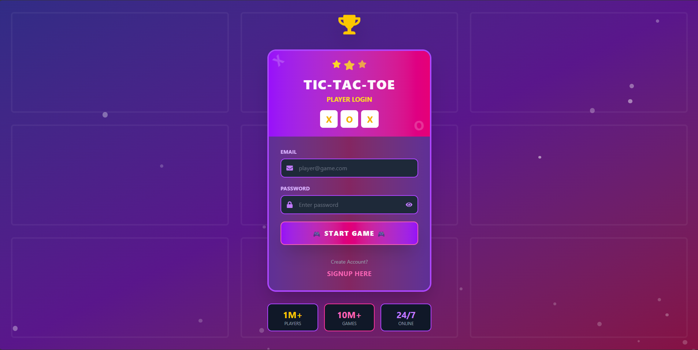
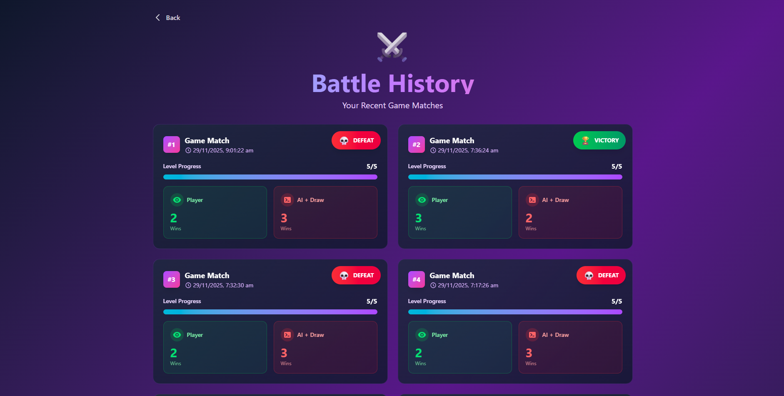
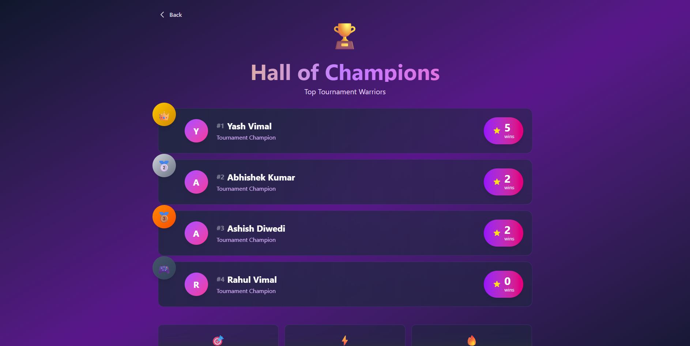
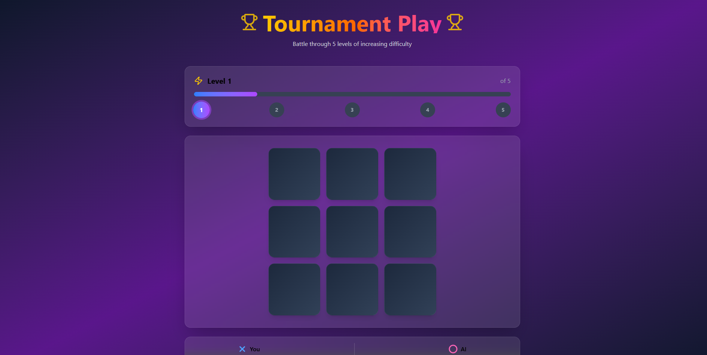
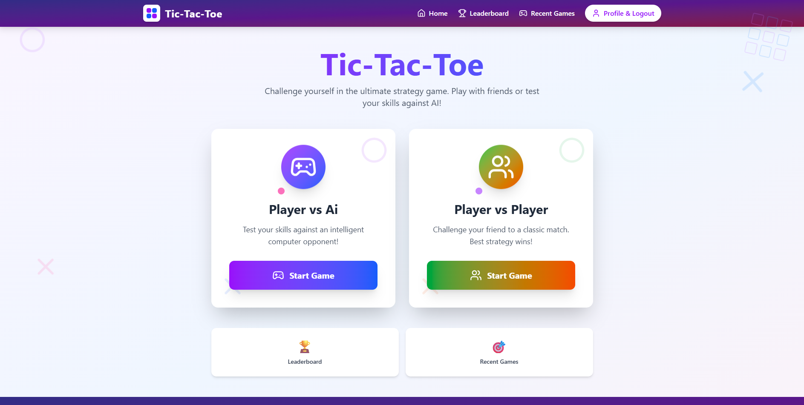

# 🎮 Tic-Tac-Toe Tournament (MERN Stack)

### A full-stack Tic-Tac-Toe Tournament game built using the MERN stack, featuring:

. AI opponent (Easy, Medium, Hard)
. Multi-level tournament system
. Player authentication (JWT)
. Win tracking: Player Wins, AI Wins
. Recent game history
. Leaderboard-ready structure
. Beautiful responsive UI

